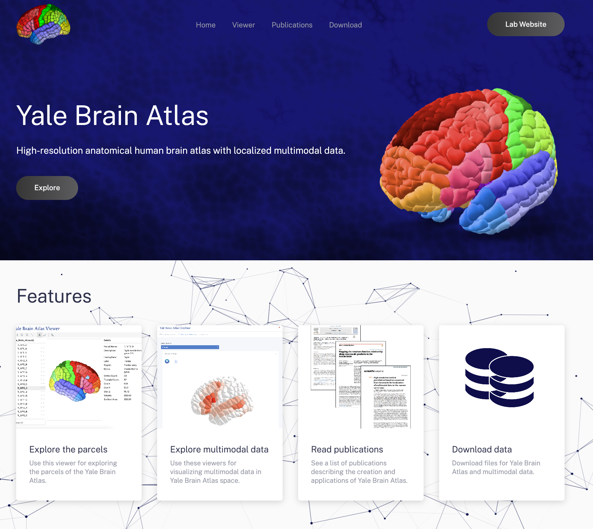

# Yale Brain Atlas

  

*Image: Website for Yale Brain Atlas. Evan Collins / Yale*

## Description

This repository contains contains all code needed to run [the website for the Yale Brain Atlas](https://yalebrainatlas.github.io/YaleBrainAtlas/). Additionally, this repository stores all data for Yale Brain Atlas and its multimodal neuroimaging data in the `/data` folder.

This repository was introduced as part of our paper "The Yale Brain Atlas to interactively explore multimodal structural and functional neuroimaging data".

# Abstract

Understanding the relationship between structure and function in the human brain is essential for revealing how brain organization influences behavior and disease. To this end, we introduce structural and functional neuroimaging data and interactive software for the Yale Brain Atlas, whose high-resolution anatomical parcellation facilitates precise localization and generalizable analyses. For structural data, we provide white matter connectomes of 1065 subjects and cortical thickness profiles of 200 subjects both from the Human Connectome Project in Yale Brain Atlas space. For functional data, we include resting-state fMRI connectivity matrices for 34 healthy subjects and task-specific fMRI activation data acquired from two meta-analytic resources – Neurosynth and NeuroQuery – which, once translated into Yale Brain Atlas space and modified to include 334 function-specific terms, form Parcelsynth and ParcelQuery, respectively. Lastly, we introduce a website to interactively explore the Yale Brain Atlas and this structural and functional neuroimaging data.

# Data

Visit the `/data` folder to access downloadable data for Yale Brain Atlas and its multimodal neuroimaging data.
